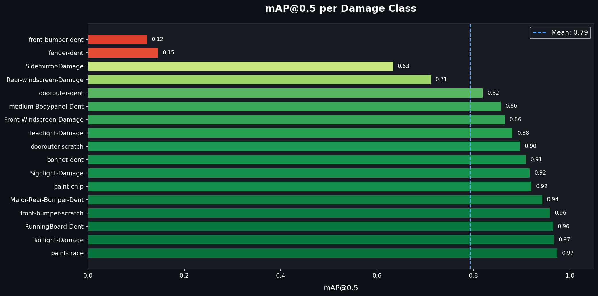
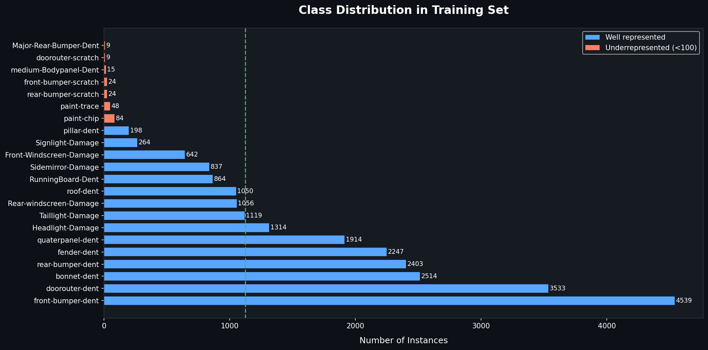

# Vehicle Damage Detector

Fine-tuned **YOLOv8m** for detecting and classifying 23 types of car damage - dents, scratches, broken lights, cracked windshields, and more. Deployed as a public demo on Hugging Face Spaces.

**Live demo:** https://huggingface.co/spaces/rwandashi/vehicle-damage-detector

---

## Results

| Metric    | Score |
|-----------|-------|
| mAP@0.5   | 0.793 |
| Precision | 0.863 |
| Recall    | 0.791 |
| F1        | 0.826 |

Evaluated on a held-out validation set of 773 images / 1,112 instances. Per-class mAP and the full confusion matrix are in [`reports/figures/`](reports/figures).



## Quick start

```bash
git clone https://github.com/rwandashi/vehicle-damage-detector.git
cd vehicle-damage-detector
pip install -r requirements.txt

# Set your Roboflow key (only needed if you want to re-download the dataset)
cp .env.example .env
# edit .env and add ROBOFLOW_API_KEY=...

# Run inference on a sample image (downloads weights from Hugging Face automatically)
python -m src.predict --image examples/input_1.jpg

# Or launch the Gradio demo locally
python -m src.app
```

## Dataset

- **Source:** [Roboflow - Car Damage Detection](https://universe.roboflow.com/rwandashis-workspace/car-damage-detection-5ioys-f4qah)
- **Size:** 6,839 images across train / valid / test splits
- **Classes:** 23 damage types (e.g. `dent`, `scratch`, `broken-headlight`, `cracked-windshield`, ...)
- **Format:** YOLOv8 (one `.txt` label per image)

The dataset is **not** committed to this repo. Run `python -m src.download_data` to fetch it via the Roboflow API into `./datasets/`.

### Class distribution



The dataset is moderately imbalanced - several rare classes have fewer than 100 instances. This is reflected in lower per-class mAP for those categories (see Limitations below).

## Training

YOLOv8m was fine-tuned for 50 epochs at 640*640 resolution with batch size 16, early stopping patience 10. Hyperparameters live in [`configs/train.yaml`](configs/train.yaml).

```bash
python -m src.train --config configs/train.yaml
```

Training takes ~2 hours on a single NVIDIA L4 (Colab). Best weights are saved to `runs/detect/car_damage_v1/weights/best.pt`.

## Evaluation

```bash
python -m src.evaluate --weights checkpoints/best.pt --data datasets/car-damage/data.yaml
```

Produces the metrics table above plus per-class mAP and the confusion matrix (saved to `reports/figures/`).

## Project structure

```
.
|-- src/
|   |-- download_data.py    # Roboflow download
|   |-- eda.py              # class distribution, bbox & aspect ratio plots
|   |-- train.py            # YOLOv8 fine-tuning
|   |-- evaluate.py         # validation metrics + confusion matrix
|   |-- predict.py          # CLI inference on a single image
|   |-- app.py              # Gradio web demo
|   `-- plot_style.py       # shared dark-theme matplotlib config
|-- configs/train.yaml
|-- notebooks/01_walkthrough.ipynb
|-- reports/figures/
|-- examples/
`-- requirements.txt
```

## Limitations & future work

- **Class imbalance.** Several damage classes have <100 training instances, which hurts per-class mAP. Worth trying weighted sampling, copy-paste augmentation, or merging visually similar classes.
- **Domain shift.** Training images are mostly clean, well-lit photos. Performance drops on phone snapshots taken at odd angles or in poor lighting - common in real insurance use cases.
- **Backbone size.** Only YOLOv8m was tried. A side-by-side comparison with `yolov8s` (faster) and `yolov8l` (more accurate) would make the model-selection story stronger.
- **No severity grading.** The model classifies damage *type* but not *severity*, which is what an insurance pipeline would actually need next.

## Author

**Rwandashi Eugene**

## License

MIT - see [LICENSE](LICENSE).